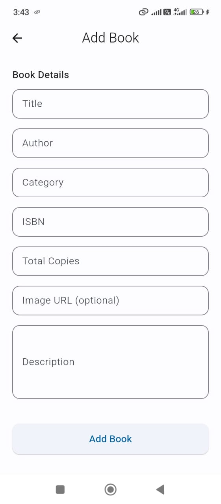
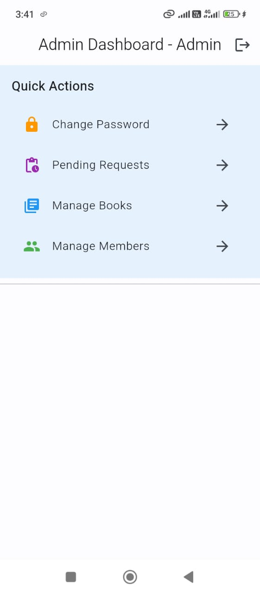
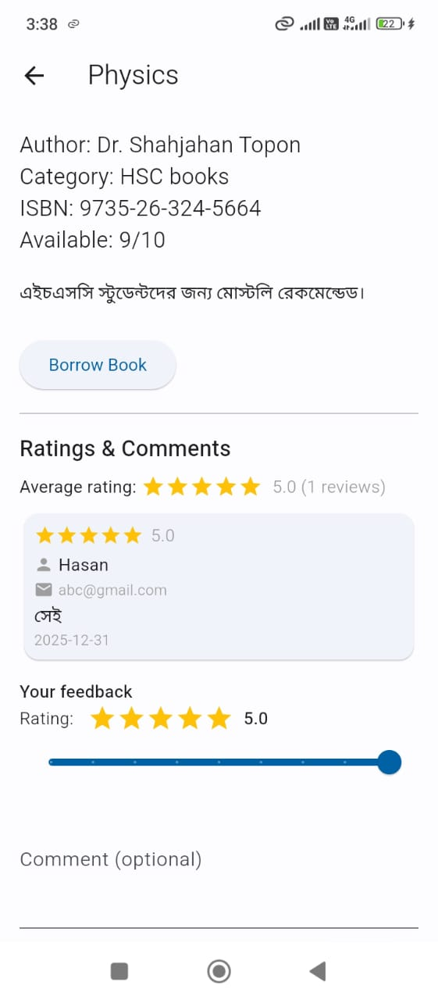
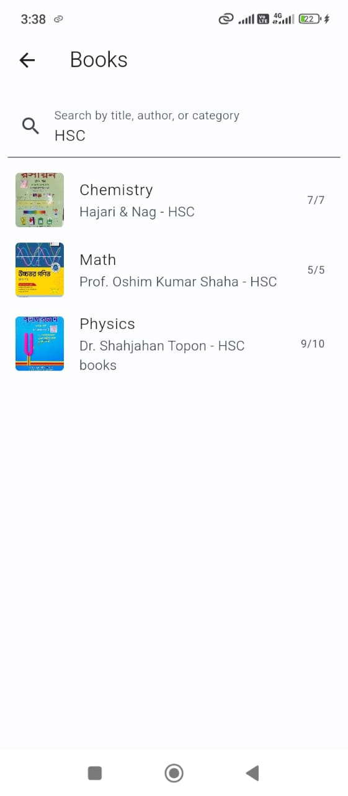
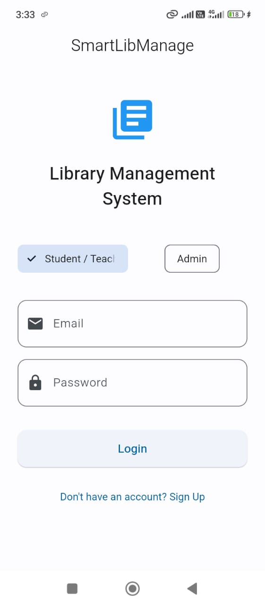
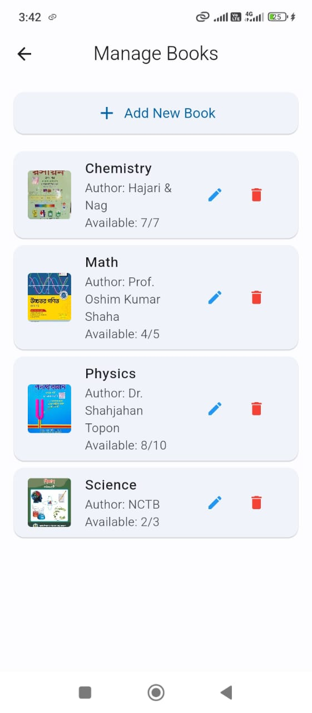
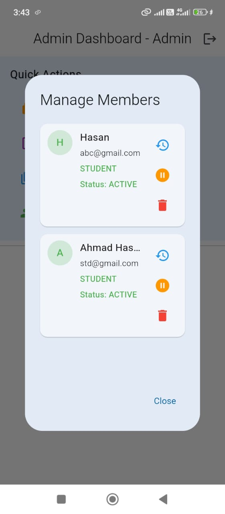
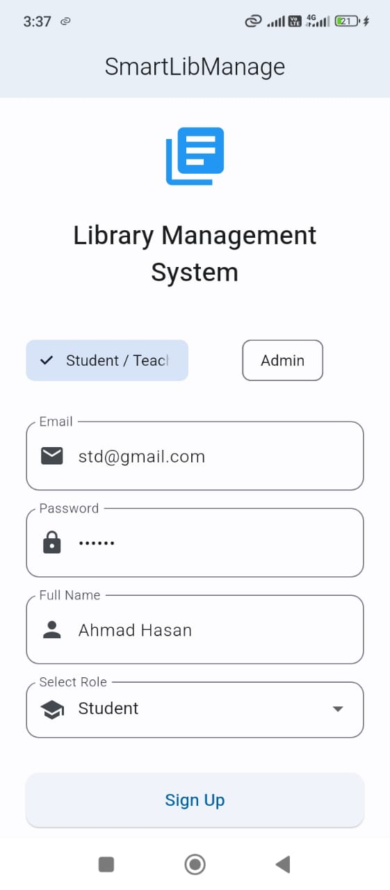
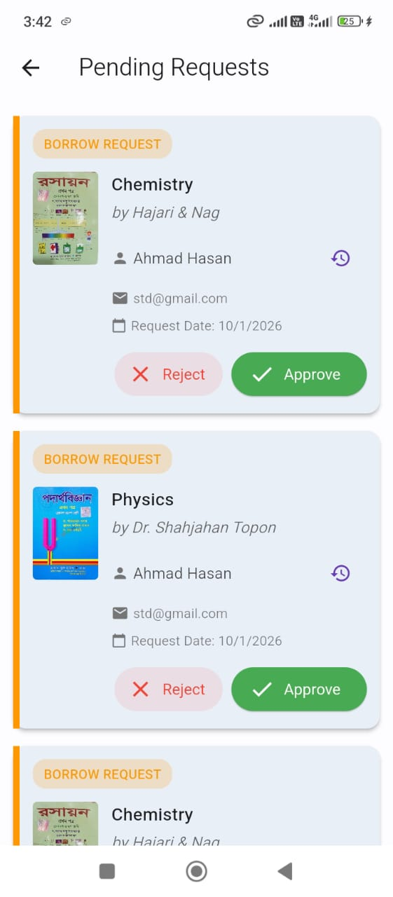

# CSE 3200 Project Report

---

# SmartLibManage
## A Smart Library Management System

---

**Course:** CSE 3200 - Software Engineering Project  
**Submission Date:** January 2026

---

## Student Information

| Name | ID |
|------|-----|
| Ahmad Hasan | 2103160 |

**Supervisor:** Dr. Julia Rahman (Associate Professor, Dept. of CSE, RUET)  
**Department:** Computer Science and Engineering

---

# Abstract

SmartLibManage is a mobile-first library management system designed to address common problems in traditional, manual, or semi-digital library workflows—such as inaccurate availability tracking, slow borrowing/return processes, limited remote access to the catalog, and missing due-date reminders. The project delivers an end-to-end Android-focused solution built with Flutter and Firebase, providing secure authentication (email/password) with role-based access for Admin and Members (students/teachers). Cloud Firestore is used as the central database to store user profiles, book records, and borrowing transactions, enabling real-time synchronization across devices. The system implements core library operations including book browsing and search, book inventory management (add/edit/delete), borrowing and return request workflows, and an approval mechanism for pending borrow/return actions to ensure administrative control. A notification layer (Firebase Cloud Messaging with local notification support) is integrated to support timely alerts and reminders. The application follows a clean modular structure using Provider for state management and a dedicated Firestore service layer for CRUD operations and streaming updates. Functional validation through feature-based testing confirmed correct role separation, consistent catalog updates, and reliable status transitions for borrow/return lifecycles (active, pending borrow, pending return, returned). The primary contribution of this work is a practical, scalable, and low-cost reference implementation of a modern library management app that combines real-time database synchronization, structured approval workflows, and a user-friendly dashboard experience for both administrators and members, suitable for adaptation in academic library environments.

---

# List of Figures

(Auto-generated list of all figures.)

---

# List of Tables

(Auto-generated list of all tables.)

---

# Table of Contents

1. [Introduction](#chapter-1-introduction)
2. [Literature Review & Background Study](#chapter-2-literature-review--background-study)
3. [Problem Statement & Planning](#chapter-3-problem-statement--planning)
4. [Project Management & Finance](#chapter-4-project-management--finance)
5. [System Design & Architecture](#chapter-5-system-design--architecture)
6. [Implementation](#chapter-6-implementation)
7. [Testing, Results & Evaluation](#chapter-7-testing-results--evaluation)
8. [Discussion & Analysis](#chapter-8-discussion--analysis)
9. [Life-long Learning Impact](#chapter-9-life-long-learning-impact)
10. [Conclusion](#chapter-10-conclusion)
11. [References](#references)
12. [Appendix](#appendix)

---

# Chapter 1
## Introduction

### 1.1 Problem Statement

Many academic libraries still manage book inventory and borrowing/return transactions using manual registers or fragmented digital tools. This causes inaccurate or outdated book availability information, slow service at the library counter, poor tracking of borrowing history, and lack of timely due-date reminders—leading to overdue books and reduced user satisfaction. The project solves this by providing a single, mobile-based system that maintains a real-time book catalog, securely manages users, and supports controlled borrowing/return workflows with administrative oversight.

### 1.2 Motivation

Libraries are a core service in universities and colleges, but their workflows are often constrained by limited staffing, high daily transaction volume, and the need for accurate record keeping. Students and teachers increasingly expect remote access to services (searching availability, viewing details, tracking due dates) from smartphones. A modern mobile solution with cloud synchronization can reduce operational burden, minimize errors, and improve accessibility—making the library more efficient and user-friendly.

### 1.3 Objectives

The measurable goals of SmartLibManage are:

1. Implement secure user authentication (email/password) with role-based access (Admin vs Member).
2. Provide a searchable book catalog with detailed book information and real-time availability.
3. Enable admins to perform full inventory management (add/edit/delete books) and reflect updates instantly.
4. Support borrowing and return workflows with clear status tracking and admin confirmation/approval.
5. Maintain borrowing history per user and allow monitoring of due dates and overdue status.
6. Integrate a notification mechanism to support reminders and request status updates.
7. Ensure cloud-based persistence and consistency using Firebase services.

### 1.4 Contribution Summary

This project contributes a complete, working reference implementation of a mobile library management system using Flutter + Firebase, featuring:

- Real-time, cloud-synced catalog and transaction records via Cloud Firestore streams.
- Role-based dashboards with separation of admin and member capabilities.
- Structured request/approval workflow for borrowing and returning to maintain control and accountability.
- A modular Flutter architecture using Provider and a service layer to keep UI and data logic organized.
- Practical usability features such as due-date tracking and status indicators (e.g., returned/overdue).

### 1.5 Report Structure

- Chapter 1 (Introduction): Defines the problem, motivation, objectives, contributions, and report layout.
- Chapter 2 (Background & Literature Review): Reviews concepts, related systems, comparisons, and gaps.
- Chapter 3 (Requirements & Team Workflow): Lists functional/non-functional requirements, constraints, and technology choices (individual workflow).
- Chapter 4 (Project Management & Finance): Presents WBS, schedule, zero-cost analysis, risks, and key decisions.
- Chapter 5 (System Design & Architecture): Explains architecture, module interaction, database schema, and security/performance design.
- Chapter 6 (Implementation): Describes environment setup, coding standards, module implementations, and integration workflow.
- Chapter 7 (Testing, Results & Evaluation): Shows testing strategy, test cases, performance evaluation, and screenshots.
- Chapter 8 (Discussion & Analysis): Interprets results, strengths, limitations, and future improvements.
- Chapter 9 (Life-long Learning Impact): Summarizes skills gained, new tools learned, and future directions.
- Chapter 10 (Conclusion): Wraps up work summary, objective achievement, and final remarks.

---

# Chapter 2
## Background & Literature Review

### 2.1 Theoretical Foundation

SmartLibManage is grounded in several fundamental concepts of software engineering and information systems:

- Library information systems: A library system maintains structured records of books, members, and transactions (borrow/return). The core challenge is keeping inventory state (available vs borrowed) consistent and queryable while supporting frequent operations.
- Client–server and cloud-based architecture: Modern mobile systems typically follow a client (mobile app) + backend (cloud services) model. The backend provides centralized data storage, authentication, and synchronization so multiple users can interact with the same dataset reliably.
- Authentication and role-based access control (RBAC): RBAC restricts actions based on user roles (e.g., admin vs member). This is essential for library systems where only authorized staff should modify inventory, approve requests, or manage users.
- NoSQL document databases: Document databases store data as collections of flexible documents. This fits book and borrowing records well, supports rapid iteration, and enables real-time updates via listeners.
- Workflow and state modeling: Borrowing and returning can be modeled as a state machine (e.g., pending_borrow → active → pending_return → returned). Clear state transitions reduce ambiguity and support auditing.
- Mobile UI architecture and state management: Separating UI (screens/widgets), state (providers), and data services improves maintainability and testability. Reactive state management ensures UI reflects backend updates quickly.

### 2.2 Related Work Review

Existing approaches to library management typically fall into these categories:

- Manual / paper-based systems: Register books and transactions in ledgers. This approach is simple but error-prone, hard to audit, and does not provide real-time availability.
- Spreadsheet-based tracking: Uses Excel/Google Sheets to manage inventory and borrow logs. This improves searchability but suffers from concurrency issues, inconsistent updates, and weak access control.
- Desktop/local network library software: Traditional installed software can handle cataloging and lending, but often requires dedicated machines, local network access, and IT maintenance; remote access for students is limited.
- Web-based library management systems: Provide browser portals for catalog browsing and staff operations. While more accessible than desktop systems, they may not provide a smooth mobile-first experience and may lack real-time notifications.
- Open-source integrated library systems (ILS): Mature systems exist with rich features, but setup complexity, customization effort, and hosting requirements can be high for small deployments or student projects.
- Mobile library applications: Some institutions offer mobile apps, but many are tightly coupled to specific infrastructures and are not easily adaptable as a lightweight general solution.

### 2.3 Comparative Analysis

A comparison of common approaches highlights why a mobile + cloud model is practical for academic environments:

- Manual systems
  - Strength: low cost and no infrastructure
  - Limitations: no real-time availability, high human error, poor reporting, records can be lost
- Spreadsheets
  - Strength: easy to start and basic search/filter
  - Limitations: weak security, conflicts with concurrent edits, not designed for transaction workflows, no automated notifications
- Desktop/local systems
  - Strength: structured circulation management in local environment
  - Limitations: limited remote access, higher maintenance, harder to scale, not mobile-first
- Web-based systems
  - Strength: centralized data and access anywhere with internet
  - Limitations: requires hosting/maintenance; mobile UX and real-time alerts vary by implementation
- Cloud-backed mobile apps (SmartLibManage approach)
  - Strength: mobile-first access, centralized real-time database, scalable backend without managing servers
  - Limitations: internet dependency; needs careful security rules and role enforcement

### 2.4 Gap Analysis

From the review above, several gaps are commonly observed in typical academic library settings and in many lightweight solutions:

1. Lack of real-time availability visibility: Many systems do not reliably reflect live availability, causing wasted time for users and staff.
2. Missing structured approval workflows: Without a state-driven workflow (pending/approved/returned), accountability and tracking become weak.
3. Insufficient mobile-first experience: Even when web systems exist, mobile usability and quick actions are often not optimized.
4. No automated reminders and notifications: Due-date alerts and request-status updates are frequently absent, increasing overdue rates.
5. High setup/maintenance overhead in full-featured systems: Mature ILS solutions can be powerful but are often too complex for small deployments.
6. Weak role-based enforcement in lightweight systems: Many basic tools do not strongly separate admin actions from member actions.

SmartLibManage is designed to address these gaps by combining a mobile-first interface with cloud-based real-time synchronization, RBAC-driven dashboards, workflow-based borrow/return states, and notification support.

---

# Chapter 3
## Requirements & Team Workflow

### 3.1 Functional Requirements

The system must support the following user-facing functions:

| ID | Requirement | Priority |
|----|------------|----------|
| FR1 | User registration with email/password | High |
| FR2 | Role-based login (Admin, Student, Teacher) | High |
| FR3 | Browse and search book catalog | High |
| FR4 | View book details (title, author, availability) | High |
| FR5 | Request book borrowing | High |
| FR6 | Admin approval for borrow requests | High |
| FR7 | Request book return | High |
| FR8 | Admin confirmation for returns | High |
| FR9 | Add/Edit/Delete books (Admin) | High |
| FR10 | Manage user accounts (Admin) | Medium |
| FR11 | View borrow history | Medium |
| FR12 | Push notifications for due dates | Medium |
| FR13 | Password change functionality | Low |

### 3.2 Non-functional Requirements

The system must satisfy the following quality constraints:

| ID | Requirement | Specification |
|----|------------|---------------|
| NFR1 | Performance | App launch < 3 seconds |
| NFR2 | Availability | 99.9% uptime (Firebase SLA) |
| NFR3 | Security | Encrypted data transmission (HTTPS) |
| NFR4 | Scalability | Support 1000+ concurrent users |
| NFR5 | Usability | Intuitive UI, < 3 clicks for main actions |
| NFR6 | Compatibility | Android 6.0+ support |

### 3.3 System Constraints

**Hardware Constraints:**
- Target devices: Android smartphones with minimum 2GB RAM
- Internet connectivity required for all operations

**Software Constraints:**
- Flutter SDK version 3.3.3 or higher
- Firebase project with Blaze plan for production
- Android SDK minimum version 21

**Legal Constraints:**
- User data privacy compliance (data stored securely on Firebase)
- No collection of unnecessary personal information

### 3.4 Technology Stack Justification

| Technology | Justification |
|------------|---------------|
| **Flutter** | Cross-platform development, single codebase, excellent performance, large community |
| **Dart** | Type-safe, easy to learn, optimized for UI development |
| **Firebase Auth** | Secure, scalable, easy integration, supports multiple auth methods |
| **Cloud Firestore** | Real-time sync, offline support, NoSQL flexibility, automatic scaling |
| **Firebase Messaging** | Reliable push notifications, easy integration with Flutter |
| **Provider** | Officially recommended state management, simple and efficient |

### 3.5 Team Structure & Individual Responsibilities

This was an individual project. All aspects of planning, development, and testing were handled by a single developer:

| Area | Responsibilities |
|------|------------------|
| Project Management | Requirements gathering, planning, timeline management |
| Backend Development | Firebase integration, Authentication, Firestore services |
| Frontend Development | UI implementation, Screen navigation, Widget development |
| Database Design | Firestore schema design, Data models, CRUD operations |
| UI/UX Design | Interface design, User experience optimization |
| Testing & QA | Unit testing, Integration testing, Bug fixing |

### 3.6 Collaboration Workflow

Since the project was completed individually, a lightweight workflow was followed to ensure consistent progress and traceability:

- Version control: Git (incremental commits after each feature)
- Work tracking: personal Kanban/checklist (e.g., Trello-style columns: To Do → In Progress → Done)
- Milestones: weekly targets aligned with major modules (Auth, Catalog, Borrow/Return, Admin tools, Notifications)
- Documentation: README + inline code documentation for setup and module behavior

If required by the template, screenshots of the task board and commit history can be added to the Appendix.

---

# Chapter 4
## Project Management & Finance

### 4.1 Work Breakdown Structure (WBS)

The project was decomposed into phases and sub-tasks to plan, track, and validate deliverables in an individual development setting.

```
SmartLibManage Project
├── 1. Planning & Analysis (Week 1-2)
│   ├── 1.1 Requirements gathering
│   ├── 1.2 Technology research
│   ├── 1.3 System design
│   └── 1.4 Project timeline creation
├── 2. Design Phase (Week 3-4)
│   ├── 2.1 UI/UX wireframes
│   ├── 2.2 Database schema design
│   ├── 2.3 Architecture design
│   └── 2.4 API contract definition
├── 3. Development Phase (Week 5-10)
│   ├── 3.1 Firebase setup
│   ├── 3.2 Authentication module
│   ├── 3.3 Book management module
│   ├── 3.4 Borrowing module
│   ├── 3.5 Admin dashboard
│   ├── 3.6 User dashboard
│   └── 3.7 Notification system
├── 4. Testing Phase (Week 11-12)
│   ├── 4.1 Unit testing
│   ├── 4.2 Integration testing
│   ├── 4.3 User acceptance testing
│   └── 4.4 Bug fixes
└── 5. Deployment & Documentation (Week 13-14)
    ├── 5.1 Production deployment
    ├── 5.2 Documentation
    └── 5.3 Final presentation
```

### 4.2 Project Schedule — Gantt Chart

| Phase | Week 1-2 | Week 3-4 | Week 5-6 | Week 7-8 | Week 9-10 | Week 11-12 | Week 13-14 |
|-------|----------|----------|----------|----------|-----------|------------|------------|
| Planning | ████████ | | | | | | |
| Design | | ████████ | | | | | |
| Auth Module | | | ████████ | | | | |
| Book Module | | | ████████ | ████████ | | | |
| Borrow Module | | | | ████████ | ████████ | | |
| Dashboards | | | | | ████████ | | |
| Notifications | | | | | ████████ | | |
| Testing | | | | | | ████████ | |
| Deployment | | | | | | | ████████ |

**Key milestones and dependencies:**
- **M1: Requirements & design baseline (end of Week 4)** → prerequisite for implementation modules
- **M2: Firebase initialization + Auth stable (end of Week 6)** → prerequisite for role-based navigation and protected screens
- **M3: Catalog CRUD complete (end of Week 8)** → prerequisite for borrowing flows
- **M4: Borrow/return + admin approvals complete (end of Week 10)** → prerequisite for end-to-end testing
- **M5: Notifications integrated (end of Week 10)** → depends on Firebase Messaging + local notifications setup
- **M6: Test pass + documentation freeze (end of Week 12)** → prerequisite for packaging/submission
- **M7: Final report & submission (end of Week 14)**

Schedule dependencies were managed by completing platform setup first (Firebase + project configuration), then core flows (Auth → Catalog → Borrow/Return), and finally cross-cutting concerns (notifications, testing, documentation).

### 4.3 Budget & Financial Cost Analysis

| Item | Cost (BDT) | Notes |
|------|------------|-------|
| Development Tools | 0 | Flutter, VS Code, Android Studio (Free & Open Source) |
| Firebase Spark Plan | 0 | Free tier - sufficient for development and testing |
| Testing Devices | 0 | Personal Android device used |
| Hosting & Backend | 0 | Firebase free tier covers all requirements |
| **Total Cost** | **0** | No financial investment required |

**Financial planning and estimation:**
- **Estimated cost at current scope:** 0 BDT (uses free tools + Firebase Spark Plan)
- **Contingency plan (if usage grows beyond free tier):** enforce quotas/limits in development, optimize queries, compress images, and only then consider upgrading the Firebase plan (optional; not required for this project submission)
- **Cost control decisions:** avoid paid services, rely on open-source tooling, and keep data storage and messaging within free-tier limits

### 4.4 Risk Analysis & Mitigation Plan

| Risk | Probability | Impact | Mitigation Strategy |
|------|-------------|--------|---------------------|
| Firebase quota exceeded | Low | High | Monitor usage, implement caching |
| Time management issues | Medium | Medium | Proper scheduling, milestone tracking |
| Scope creep | High | Medium | Strict adherence to defined requirements |
| Technical difficulties | Medium | High | Online resources, documentation study |
| Data loss | Low | Critical | Regular backups, Firebase redundancy |
| Security vulnerabilities | Low | Critical | Follow Firebase security best practices |

In practice, risks were handled through early configuration validation (Firebase setup and rules), incremental development (small, testable changes), and frequent verification of user flows (login → browse → borrow/return → admin approvals).

### 4.5 Summary of Management Decisions

1. **Incremental development approach** adopted for manageable progress tracking
2. **Firebase selected** over custom backend to reduce development complexity for individual developer
3. **Provider chosen** over BLoC for simpler state management and faster learning curve
4. **Android-first approach** with iOS support planned for future
5. **Minimum Viable Product (MVP) scope** defined to ensure timely delivery by single developer

---

# Chapter 5
## System Design & Architecture

### 5.1 Methodological Structure

SmartLibManage uses a layered Flutter architecture with **Provider** for state management. At a top level, the system separates presentation (UI), state/business logic, and data access so that UI changes do not directly affect database operations.

The structure can be summarized as **Model – View – Provider/Service** (a practical MVVM-style structure for Flutter):

```
┌─────────────────────────────────────────────────────────┐
│                    Presentation Layer                    │
│  ┌─────────────┐  ┌─────────────┐  ┌─────────────┐     │
│  │   Screens   │  │   Widgets   │  │  Providers  │     │
│  └─────────────┘  └─────────────┘  └─────────────┘     │
└─────────────────────────────────────────────────────────┘
                           │
                           ▼
┌─────────────────────────────────────────────────────────┐
│                     Business Layer                       │
│  ┌─────────────┐  ┌─────────────┐  ┌─────────────┐     │
│  │   Services  │  │   Models    │  │  Utilities  │     │
│  └─────────────┘  └─────────────┘  └─────────────┘     │
└─────────────────────────────────────────────────────────┘
                           │
                           ▼
┌─────────────────────────────────────────────────────────┐
│                      Data Layer                          │
│  ┌─────────────────────────────────────────────────┐   │
│  │              Firebase Backend                    │   │
│  │  ┌───────────┐ ┌───────────┐ ┌───────────┐     │   │
│  │  │   Auth    │ │ Firestore │ │ Messaging │     │   │
│  │  └───────────┘ └───────────┘ └───────────┘     │   │
│  └─────────────────────────────────────────────────┘   │
└─────────────────────────────────────────────────────────┘
```

### 5.2 High-Level Architecture Diagram

The diagram below shows how the mobile client is organized and how it exchanges data with Firebase services. The app communicates with Firebase using official SDKs; Firestore provides real-time streams for updates.

```
┌──────────────────────────────────────────────────────────────┐
│                      SmartLibManage App                       │
├──────────────────────────────────────────────────────────────┤
│                                                              │
│  ┌────────────┐    ┌────────────┐    ┌────────────┐        │
│  │   Login    │───▶│    Home    │───▶│  Dashboard │        │
│  │   Screen   │    │   Screen   │    │  (Role)    │        │
│  └────────────┘    └────────────┘    └────────────┘        │
│        │                                    │                │
│        ▼                                    ▼                │
│  ┌────────────┐              ┌─────────────────────────┐    │
│  │  Sign Up   │              │    Admin    │   User    │    │
│  │   Screen   │              │  Dashboard  │ Dashboard │    │
│  └────────────┘              └─────────────────────────┘    │
│                                      │           │          │
│                              ┌───────┴───────┐   │          │
│                              ▼               ▼   ▼          │
│                        ┌──────────┐    ┌──────────┐        │
│                        │  Manage  │    │  Browse  │        │
│                        │  Books   │    │  Books   │        │
│                        └──────────┘    └──────────┘        │
│                              │               │              │
│                              ▼               ▼              │
│                        ┌──────────┐    ┌──────────┐        │
│                        │ Pending  │    │  Borrow  │        │
│                        │ Requests │    │  History │        │
│                        └──────────┘    └──────────┘        │
│                                                              │
└──────────────────────────────────────────────────────────────┘
                              │
                              ▼
┌──────────────────────────────────────────────────────────────┐
│                    Firebase Backend                           │
│  ┌──────────────┐  ┌──────────────┐  ┌──────────────┐       │
│  │ Authentication│  │  Firestore   │  │   Cloud      │       │
│  │   Service    │  │  Database    │  │  Messaging   │       │
│  └──────────────┘  └──────────────┘  └──────────────┘       │
└──────────────────────────────────────────────────────────────┘
```

### 5.3 Module Interaction Diagram

To describe the broader domain where the problem exists (library operations), the system can be viewed as a set of actors and external services interacting with the mobile application and Firebase backend.

**System context (domain interaction):**

```
┌──────────────────────────────────────────────────────────────────────┐
│                         Library Stakeholders                          │
├──────────────────────────────────────────────────────────────────────┤
│  Admin/Librarian: manages catalog, approvals, users                   │
│  Student/Teacher: searches books, requests borrow/return, views status│
└──────────────────────────────────────────────────────────────────────┘
                    │                                   │
                    ▼                                   ▼
┌──────────────────────────────┐            ┌──────────────────────────┐
│     SmartLibManage (App)     │            │  Device/OS Notifications  │
│  Flutter UI + Providers      │───────────▶│ (Local notifications)     │
└──────────────────────────────┘            └──────────────────────────┘
                    │
                    ▼
┌──────────────────────────────────────────────────────────────────────┐
│                           Firebase Services                            │
├──────────────────────────────────────────────────────────────────────┤
│  Auth: login/session        Firestore: users/books/borrows data        │
│  Cloud Messaging: push notifications                                   │
└──────────────────────────────────────────────────────────────────────┘
```

**Internal module interaction (within the app):**

```
┌─────────────────────────────────────────────────────────────────┐
│                         User Interaction                         │
└─────────────────────────────────────────────────────────────────┘
                                │
                                ▼
┌─────────────────────────────────────────────────────────────────┐
│                      AuthProvider                                │
│  • Sign In / Sign Up / Sign Out                                 │
│  • Role-based navigation                                        │
│  • Session management                                           │
└─────────────────────────────────────────────────────────────────┘
                                │
                    ┌───────────┴───────────┐
                    ▼                       ▼
┌───────────────────────────┐  ┌───────────────────────────┐
│      BookProvider         │  │    FirestoreService       │
│  • Book list management   │  │  • CRUD operations        │
│  • Search functionality   │  │  • Real-time streams      │
│  • State notifications    │  │  • Data synchronization   │
└───────────────────────────┘  └───────────────────────────┘
                    │                       │
                    └───────────┬───────────┘
                                ▼
┌─────────────────────────────────────────────────────────────────┐
│                    NotificationService                           │
│  • Push notification handling                                    │
│  • Due date reminders                                           │
│  • Request status updates                                        │
└─────────────────────────────────────────────────────────────────┘
```

### 5.4 Database Schema / ER Diagram

**Firestore Collections:**

```
┌─────────────────────────────────────────────────────────────────┐
│                         USERS Collection                         │
├─────────────────────────────────────────────────────────────────┤
│  Document ID: {uid}                                             │
│  ├── email: String                                              │
│  ├── name: String                                               │
│  ├── role: String ("student" | "teacher" | "admin")             │
│  ├── borrowedBooks: Array<String>                               │
│  └── status: String ("active" | "inactive")                     │
└─────────────────────────────────────────────────────────────────┘
                                │
                                │ 1:N
                                ▼
┌─────────────────────────────────────────────────────────────────┐
│                        BORROWS Collection                        │
├─────────────────────────────────────────────────────────────────┤
│  Document ID: {auto-generated}                                  │
│  ├── userId: String (Reference to Users)                        │
│  ├── bookId: String (Reference to Books)                        │
│  ├── borrowDate: Timestamp                                      │
│  ├── dueDate: Timestamp                                         │
│  ├── returnDate: Timestamp (nullable)                           │
│  ├── isReturned: Boolean                                        │
│  └── status: String ("active"|"pending_borrow"|"pending_return")│
└─────────────────────────────────────────────────────────────────┘
                                │
                                │ N:1
                                ▼
┌─────────────────────────────────────────────────────────────────┐
│                         BOOKS Collection                         │
├─────────────────────────────────────────────────────────────────┤
│  Document ID: {auto-generated}                                  │
│  ├── title: String                                              │
│  ├── author: String                                             │
│  ├── category: String                                           │
│  ├── isbn: String                                               │
│  ├── totalCopies: Number                                        │
│  ├── availableCopies: Number                                    │
│  ├── description: String                                        │
│  └── imageUrl: String (nullable)                                │
└─────────────────────────────────────────────────────────────────┘
```

**Entity Relationships:**
- One User can have Many BorrowRecords (1:N)
- One Book can have Many BorrowRecords (1:N)
- BorrowRecord links User and Book (Junction)

### 5.5 Interface Specifications / API Contracts

SmartLibManage does not expose a custom REST API. Instead, the application uses **Firebase SDK contracts**:
- **Authentication contracts** via FirebaseAuth (sign-in/sign-up/sign-out)
- **Data contracts** via Firestore collection/document schemas
- **Notification contracts** via Firebase Cloud Messaging (FCM) + local notification display

**Authentication (FirebaseAuth) contracts (logical endpoints):**

| Operation | Input | Output | Notes |
|----------|-------|--------|------|
| Sign Up | email, password | user credential (UID) | Creates identity, then creates profile in `/users/{uid}` |
| Sign In | email, password | session token managed by SDK | Used to authorize Firestore access |
| Sign Out | none | none | Clears local session |

**Firestore collection contracts (data endpoints):**

| Resource | Path | Primary operations | Authorization (high level) |
|---------|------|--------------------|----------------------------|
| Users | `/users/{uid}` | create/read/update | user (own) or admin |
| Books | `/books/{bookId}` | create/read/update/delete | read: authenticated, write: admin |
| Borrows | `/borrows/{borrowId}` | create/read/update | user (own) + admin approvals |

**Example document formats (request/response payloads):**

Book document (stored at `/books/{bookId}`):
```json
{
  "title": "Clean Code",
  "author": "Robert C. Martin",
  "category": "Software Engineering",
  "isbn": "9780132350884",
  "totalCopies": 5,
  "availableCopies": 3,
  "description": "A handbook of agile software craftsmanship.",
  "imageUrl": null
}
```

Borrow record document (stored at `/borrows/{borrowId}`):
```json
{
  "userId": "<uid>",
  "bookId": "<bookId>",
  "borrowDate": "<timestamp>",
  "dueDate": "<timestamp>",
  "returnDate": null,
  "isReturned": false,
  "status": "pending_borrow"
}
```

**Client-side service API (used by UI/providers):**

| Method | Parameters | Returns | Description |
|--------|------------|---------|-------------|
| `getBooks()` | None | `Stream<List<Book>>` | Real-time book list |
| `getBookById(id)` | `String` | `Future<Book?>` | Single book by ID |
| `addBook(book)` | `Book` | `Future<void>` | Add new book |
| `updateBook(id, data)` | `String, Map` | `Future<void>` | Update book |
| `deleteBook(id)` | `String` | `Future<void>` | Delete book |
| `addUser(user)` | `AppUser` | `Future<void>` | Create user profile |
| `getUser(uid)` | `String` | `Future<AppUser?>` | Get user by UID |
| `getAllUsers()` | None | `Stream<List<AppUser>>` | All users stream |
| `borrowBook(record)` | `BorrowRecord` | `Future<void>` | Create borrow request |
| `returnBook(id, date)` | `String, DateTime` | `Future<void>` | Mark book returned |
| `requestReturn(id)` | `String` | `Future<void>` | Request return approval |
| `getPendingRequests()` | None | `Stream<List<BorrowRecord>>` | Pending approvals |

### 5.6 Security & Performance Design

**Security Measures:**

1. **Firebase Authentication:** Secure email/password authentication with automatic token management
2. **Firestore Security Rules:**
```javascript
rules_version = '2';
service cloud.firestore {
  match /databases/{database}/documents {
    match /users/{userId} {
      allow read: if request.auth != null;
      allow write: if request.auth.uid == userId || isAdmin();
    }
    match /books/{bookId} {
      allow read: if request.auth != null;
      allow write: if isAdmin();
    }
    match /borrows/{borrowId} {
      allow read: if request.auth != null;
      allow create: if request.auth != null;
      allow update: if isAdmin() || request.auth.uid == resource.data.userId;
    }
  }
}
```
3. **Input Validation:** All user inputs validated before database operations
4. **Role-based Access Control:** Admin-only operations protected in UI and backend

**Additional secure operation practices:**
- Consistent use of server-side timestamps (Firestore Timestamp) for borrow/due/return tracking
- Avoid storing sensitive credentials locally (session handled by Firebase SDK)

**Performance Optimizations:**

1. **Lazy Loading:** Books loaded on-demand with pagination
2. **Stream-based Updates:** Real-time listeners instead of polling
3. **Image Optimization:** Compressed book cover images
4. **Efficient Queries:** Indexed Firestore queries for fast retrieval

Where applicable, stream subscriptions are scoped to the active screens to avoid unnecessary listeners and reduce read costs.

---

# Chapter 6
## Implementation

### 6.1 Development Environment Setup

This project was developed on Windows and targeted Android devices. The main toolchain includes Flutter/Dart and the Android SDK build system (Gradle).

**Development environment (host + target):**
- **Host OS:** Windows (64-bit)
- **Target platform:** Android

**Required tools and configurations:**

| Tool / Component | Version (typical) | Purpose |
|------------------|-------------------|---------|
| Flutter SDK | 3.3.3+ | Flutter framework + build tools |
| Dart SDK | bundled with Flutter | Language/toolchain |
| Android Studio | 2023.1+ | Android SDK, emulator, Gradle tooling |
| Android SDK + Platform Tools | latest stable | Build + device debug |
| JDK (Java) | 11+ (Android tooling) | Required by Gradle/Android builds |
| VS Code | latest | Editor (optional; used for development) |
| Firebase Console | web | Configure Auth/Firestore/FCM |

**Project configuration highlights:**
- Firebase initialization via generated configuration file: `lib/firebase_options.dart`
- Android Firebase configuration file: `android/app/google-services.json`
- Enabled services: Firebase Authentication, Cloud Firestore, Firebase Cloud Messaging

**Setup steps (reproducible):**
1. Install Flutter SDK and verify with `flutter doctor`
2. Install Android Studio and ensure Android SDK + emulator/device drivers are configured
3. Create a Firebase project, then enable Authentication, Firestore, and (optionally) Messaging
4. Place `google-services.json` into `android/app/`
5. Run `flutter pub get` to install dependencies
6. Run the app using `flutter run` on an emulator or connected Android device

### 6.2 Coding Standards & Version Control Strategy

**Dart/Flutter Coding Standards:**
- Follow official Dart style guide
- Use `lowerCamelCase` for variables and functions
- Use `UpperCamelCase` for classes
- Prefix private members with underscore `_`
- Maximum line length: 80 characters
- Document key public APIs and business rules
- Use `dart format` for consistent formatting
- Enforce analysis/lint rules through `analysis_options.yaml`

**Version control (individual workflow):**
- Mainline development on `main` (or a single primary branch)
- Optional short-lived feature branches for larger changes (e.g., `feature/auth`, `feature/borrows`)
- Frequent small commits after a working increment (buildable, testable)
- Commit message format: `type: short description` (e.g., `feat: add borrow request flow`)

**Note on Git evidence:** this workspace copy does not include a `.git` directory, so commit IDs cannot be extracted here. For submission, include Git evidence in the Appendix (e.g., GitHub commit history screenshots or `git log --oneline` output) and reference it in the module ownership blocks below.

### 6.3 Module-Wise Implementation

#### 6.3.1 Authentication Module

**Files:** `auth_provider.dart`, `login_screen.dart`, `signup_screen.dart`

**Key Implementation:**
```dart
class AuthProvider with ChangeNotifier {
  final FirebaseAuth _auth = FirebaseAuth.instance;
  User? _user;

  Future<void> signIn(String email, String password) async {
    await _auth.signInWithEmailAndPassword(
      email: email.trim().toLowerCase(), 
      password: password
    );
  }

  Future<void> signUp(String email, String password, String name, String role) async {
    await _auth.createUserWithEmailAndPassword(email: email, password: password);
    final user = _auth.currentUser;
    if (user != null) {
      await FirestoreService().addUser(AppUser(
        uid: user.uid,
        email: email,
        name: name,
        role: role,
        borrowedBooks: [],
      ));
    }
  }
}
```

**Module Ownership Block (6.3.1):**

| Field | Details |
|------|---------|
| Developer | Ahmad Hasan |
| Module | Authentication (Sign in/up/out, role routing) |
| Tasks completed | FirebaseAuth integration, login/signup UI, role-based navigation hooks |
| Git commit evidence | Appendix: add commit IDs/screenshots for auth-related changes |

#### 6.3.2 Book Management Module

**Files:** `book.dart`, `book_provider.dart`, `add_book_screen.dart`, `edit_book_screen.dart`, `manage_books_screen.dart`

**Key Implementation:**
```dart
class Book {
  final String id;
  final String title;
  final String author;
  final String category;
  final String isbn;
  final int totalCopies;
  final int availableCopies;
  final String description;
  final String? imageUrl;

  factory Book.fromMap(String id, Map<String, dynamic> data) {
    return Book(
      id: id,
      title: data['title'] ?? '',
      author: data['author'] ?? '',
      // ... other fields
    );
  }
}
```

**Module Ownership Block (6.3.2):**

| Field | Details |
|------|---------|
| Developer | Ahmad Hasan |
| Module | Book catalog (CRUD, listing, search) |
| Tasks completed | Book model mapping, add/edit/delete screens, provider state updates |
| Git commit evidence | Appendix: add commit IDs/screenshots for book module |

#### 6.3.3 Borrowing Module

**Files:** `borrow.dart`, `firestore_service.dart`, `book_detail_screen.dart`, `pending_requests_screen.dart`

**Key Implementation:**
```dart
class BorrowRecord {
  final String id;
  final String userId;
  final String bookId;
  final DateTime borrowDate;
  final DateTime dueDate;
  final DateTime? returnDate;
  final bool isReturned;
  final String status;

  // Borrowing workflow
  Future<void> borrowBook(BorrowRecord record) async {
    await _db.collection('borrows').add(record.toMap());
  }

  Future<void> returnBook(String borrowId, DateTime returnDate) async {
    await _db.collection('borrows').doc(borrowId).update({
      'returnDate': Timestamp.fromDate(returnDate),
      'isReturned': true,
    });
  }
}
```

**Module Ownership Block (6.3.3):**

| Field | Details |
|------|---------|
| Developer | Ahmad Hasan |
| Module | Borrow/return workflow + approvals |
| Tasks completed | Borrow record model, Firestore operations, status transitions, return requests |
| Git commit evidence | Appendix: add commit IDs/screenshots for borrowing workflow |

#### 6.3.4 Dashboard Modules

**Files:** `admin_dashboard.dart`, `user_dashboard.dart`, `home_screen.dart`

**Admin Dashboard Features:**
- Quick actions panel
- Pending requests management
- Book inventory management
- Member management

**User Dashboard Features:**
- Book search
- Active borrows with status
- Borrow history
- Return request submission

**Module Ownership Block (6.3.4):**

| Field | Details |
|------|---------|
| Developer | Ahmad Hasan |
| Module | Dashboards (Admin & User) |
| Tasks completed | Role-specific UI, navigation, admin tools screens, history views |
| Git commit evidence | Appendix: add commit IDs/screenshots for dashboards |

#### 6.3.5 Notification & Reminder Module

**Files:** `notification_service.dart`, Firebase Messaging configuration

**Logic and flow:**
- Initialize notification services during app startup
- Receive push messages (FCM) and display local notifications
- Use notifications for due-date reminders and status updates (where configured)

**Module Ownership Block (6.3.5):**

| Field | Details |
|------|---------|
| Developer | Ahmad Hasan |
| Module | Notifications (FCM + local notifications) |
| Tasks completed | Startup initialization, message handling, user-facing alerts |
| Git commit evidence | Appendix: add commit IDs/screenshots for notification integration |

### 6.4 System Integration Workflow

Integration was performed incrementally to ensure each module worked independently before being combined into a full end-to-end flow.

1. **Platform + Firebase initialization**
  - Initialize Firebase at application startup
  - Configure authentication and Firestore connectivity
2. **State management integration**
  - Register `AuthProvider` and `BookProvider` at the root using `MultiProvider`
  - Ensure UI reacts to state changes through `Consumer` and `notifyListeners()`
3. **Navigation and role integration**
  - Route users based on authentication state
  - Load user role/profile and render the correct dashboard
4. **Data integration (catalog + borrows)**
  - Connect UI screens to Firestore through a service layer
  - Use Firestore streams for live updates (books, users, pending requests)
5. **Integration testing (manual + feature tests)**
  - Validate user journeys: sign-in → browse → borrow → admin approve → return → admin confirm
  - Validate failure cases: invalid login, no available copies, inactive user restrictions

```dart
void main() {
  runApp(const MyApp());
}

class MyApp extends StatelessWidget {
  @override
  Widget build(BuildContext context) {
    return FutureBuilder(
      future: _initializeApp(),
      builder: (context, snapshot) {
        return MultiProvider(
          providers: [
            ChangeNotifierProvider(create: (_) => AuthProvider()),
            ChangeNotifierProvider(create: (_) => BookProvider()),
          ],
          child: MaterialApp(
            home: Consumer<AuthProvider>(
              builder: (context, auth, _) {
                return auth.user != null ? HomeScreen() : LoginScreen();
              },
            ),
          ),
        );
      },
    );
  }
}
```

### 6.5 Performance, Optimization, and Security Techniques

**Performance Optimizations:**
1. **Const Constructors:** Used throughout for widget optimization
2. **Stream Subscriptions:** Properly disposed to prevent memory leaks
3. **Image Caching:** Network images cached locally
4. **Lazy Loading:** Lists use `ListView.builder` for efficient rendering

Additional optimizations applied where relevant:
- Prefer stream-based updates for real-time UI instead of polling
- Keep listeners scoped to active screens to reduce unnecessary reads
- Use efficient Firestore queries and indexes for common lookups

**Security Implementations:**
1. **Password Validation:** Minimum 6 characters required
2. **Email Normalization:** Lowercase and trimmed before processing
3. **Admin Protection:** Admin email cannot be used for sign-up
4. **Status Checks:** Inactive users prevented from borrowing/returning

In addition, backend security relies on **Firestore Security Rules** to enforce access control at the database level (authenticated reads, admin-only writes for protected collections).

---

# Chapter 7
## Testing, Results & Evaluation

### 7.1 Testing Strategy

Testing was performed using a combination of unit, widget, integration/system-level checks, and user acceptance testing to validate correctness, usability, and workflow completeness.

**Testing levels used:**
1. **Unit testing:** Model mapping (`fromMap`/`toMap`), provider logic, and service helpers
2. **Widget testing:** Key screens/widgets for basic rendering and state-driven UI behavior
3. **Integration/System testing:** End-to-end flows across modules (Auth → Catalog → Borrow/Return → Admin approval)
4. **User acceptance testing (UAT):** Manual evaluation from a real user perspective (admin and member roles)

**Testing Tools:**
- `flutter_test` package for unit and widget tests
- Firebase Emulator Suite for backend testing
- Manual testing on physical devices

### 7.2 Test Case Tables

#### Authentication Test Cases:

| ID | Test Case | Input | Expected Output | Actual Output | Status |
|----|-----------|-------|-----------------|---------------|--------|
| TC1 | Valid Login | admin@gmail.com, admin123 | Navigate to Admin Dashboard | Admin Dashboard displayed | Pass |
| TC2 | Invalid Login | test@test.com, wrong | Error message | "Invalid credentials" shown | Pass |
| TC3 | Student Registration | Valid email, password, name | Account created | Account created, login successful | Pass |
| TC4 | Duplicate Email | Existing email | Error message | "Email already in use" | Pass |
| TC5 | Admin Email Signup | admin@gmail.com | Blocked | "Admin account is login-only" | Pass |

#### Book Management Test Cases:

| ID | Test Case | Input | Expected Output | Actual Output | Status |
|----|-----------|-------|-----------------|---------------|--------|
| TC6 | Add Book | Valid book details | Book added to catalog | Book appears in list | Pass |
| TC7 | Edit Book | Updated title | Book updated | Title changed in catalog | Pass |
| TC8 | Delete Book | Confirm deletion | Book removed | Book no longer in list | Pass |
| TC9 | Search Book | "Flutter" | Matching books | Books with "Flutter" shown | Pass |

#### Borrowing Test Cases:

| ID | Test Case | Input | Expected Output | Actual Output | Status |
|----|-----------|-------|-----------------|---------------|--------|
| TC10 | Borrow Request | Available book | Request created | Status: pending_borrow | Pass |
| TC11 | Approve Borrow | Admin approves | Book borrowed | Book count decremented | Pass |
| TC12 | Return Request | Borrowed book | Return requested | Status: pending_return | Pass |
| TC13 | Confirm Return | Admin confirms | Book returned | Book count incremented | Pass |
| TC14 | Borrow Unavailable | 0 copies available | Blocked | "No copies available" | Pass |

### 7.3 Performance Evaluation

Performance evaluation focuses on responsiveness and resource usage on a typical Android device under normal network conditions. Since performance depends on device class, network latency, and Firebase region, results should be recorded using the same device/network for consistency.

**Measurement approach (recommended):**
- **App startup / screen rendering:** Flutter DevTools (Timeline) + Android profiler
- **Firestore response times:** timestamp logging around read/write calls (development builds)
- **Memory usage:** Android Studio Profiler
- **APK size:** build output size from release build

**Performance metrics table (fill after measurement):**

| Metric | How measured | Target (typical) | Observed result | Notes |
|--------|-------------|------------------|-----------------|------|
| App launch time | cold start timing | < 3 s | [fill] | device model + OS version |
| Login time | sign-in to dashboard | < 2 s | [fill] | depends on network |
| Book list initial load | first catalog render | < 1–2 s | [fill] | depends on cache + query |
| Search response | query to results update | < 1 s | [fill] | depends on indexing |
| Borrow request write | submit to status update | < 2 s | [fill] | Firestore write latency |
| Memory usage | steady-state after navigation | < 150 MB | [fill] | background apps affect |
| APK size | release build artifact | < 30 MB | [fill] | varies with assets |

### 7.4 Comparison with Baseline or Existing Systems

Comparison is made against a common baseline in many academic libraries: **manual register/spreadsheet-based workflows** for catalog lookup and borrow/return tracking. The baseline timings are estimates based on typical manual steps; the SmartLibManage values should be measured using the approach in Section 7.3.

| Aspect | Baseline (manual/spreadsheet workflow) | SmartLibManage (app-based) | Expected benefit |
|--------|----------------------------------------|----------------------------|-----------------|
| Catalog search | Manual lookup or staff-assisted search | In-app search and browse | Faster discovery and less staff workload |
| Availability check | Often not real-time; requires counter confirmation | Real-time `availableCopies` view | Reduces failed borrow attempts |
| Borrow/return logging | Manual entry and verification | Database-backed workflow with status | Better traceability and fewer errors |
| Due-date reminders | Manual reminders or none | Push/local notifications (if enabled) | Reduced overdue rates |
| Data preservation | Paper loss risk / fragmented records | Cloud-stored records with rules | Higher reliability and auditability |

### 7.5 Screenshots & Execution Results

The following figures are real execution screenshots of SmartLibManage.

{width=60%}

{width=60%}

{width=60%}

{width=60%}

{width=60%}

{width=60%}

{width=60%}

{width=60%}

{width=60%}

.jpeg){width=60%}

.jpeg){width=60%}

.jpeg){width=60%}

---

# Chapter 8
## Discussion & Analysis

### 8.1 Interpretation of Findings

The results indicate that SmartLibManage is a practical replacement for manual or fragmented library workflows in a real academic context.

1. **Operational impact (real context):** In a typical library, users often need to visit the counter to confirm availability and complete borrow/return steps. With SmartLibManage, the catalog and borrowing status are visible in the app, and updates propagate through Firestore in near real time. This reduces repeated counter visits and avoids stale availability information.
2. **Role separation and control:** The role-based screens and admin approval workflow mean the system supports both convenience (self-service requests) and governance (controlled approvals). This is important for institutional libraries where inventory must be verified before finalizing transactions.
3. **Data consistency:** Using a centralized Firestore database for users, books, and borrows reduces duplicate records and makes it easier to track the lifecycle of a transaction (pending → active → pending return → returned).
4. **Performance interpretation:** A measurement approach and target metrics are defined in Section 7.3. Observed values should be recorded on a chosen device/network to make performance claims repeatable.

### 8.2 Strengths of the Project

Compared to manual register/spreadsheet-based approaches (and many basic CRUD-only apps), SmartLibManage shows several strengths:

1. **End-to-end workflow coverage:** Not only catalog management, but also borrow/return requests and an approval mechanism (reduces uncontrolled transactions).
2. **Real-time synchronization:** Firestore streams help keep the catalog and pending requests up to date without manual refresh/polling.
3. **Clear modular architecture:** Providers and a service layer keep UI code separated from database operations, improving maintainability.
4. **Low-cost and deployable:** Uses free development tools and Firebase free-tier features suitable for a course project and small deployments.
5. **Role-based access:** Admin-only capabilities (book CRUD, approvals, member management) are separated from member capabilities.

### 8.3 Limitations

1. **Internet Dependency:** Full functionality requires active internet connection
2. **No Offline Mode:** Users cannot browse books without connectivity
3. **No Fine System:** Overdue books don't incur financial penalties
4. **Single Library:** System designed for single institution only
5. **No ISBN Scanning:** Manual entry required for book addition
6. **Limited Reporting:** No analytics dashboard for library statistics

### 8.4 Recommendations for Future Development

The following improvements are realistic next steps for future iterations:

1. **Offline browsing (partial):** Enable Firestore offline persistence and cache catalog data for read-only access when offline.
2. **ISBN/Barcode scanning:** Use device camera scanning to reduce manual typing when adding books.
3. **Fine and policy module:** Add configurable due-date policies and optional fine calculation (even if payment is not integrated).
4. **Analytics and reporting:** Provide admin reports (popular books, overdue list, borrow trends) for decision making.
5. **More robust notifications:** Add scheduled reminders and optional email notifications for due dates.
6. **Better audit trail:** Record who approved a request and when (admin action logs) for accountability.

### 8.5 Reflection on Design & Implementation Decisions

**Justified decisions (why they fit this project):**
- **Flutter for the client app:** A single codebase enabled rapid iteration of UI screens and workflows while targeting Android.
- **Firebase (Auth + Firestore + Messaging):** Reduced backend engineering overhead and provided a secure, production-grade identity system and real-time database.
- **Provider for state management:** Matched the project scope with a straightforward pattern for propagating authentication and book-state changes.
- **Service layer (`FirestoreService`) + models:** Centralized database operations and maintained consistent mapping between UI and data.

**Lessons learned (individual execution):**
- Defining data models and Firestore structure early reduced integration bugs later.
- Implementing security rules and role restrictions early prevents accidental privilege leaks.
- Building core flows first (Auth → Catalog → Borrow/Return) made later features (notifications, dashboards) easier to integrate.

---

# Chapter 9
## Life-long Learning Impact

### 9.1 Technical & Professional Skills Acquired

| Skill Area | Skills Learned |
|------------|----------------|
| **Mobile Development** | Flutter/Dart, widget composition, navigation, form validation, state-driven UI |
| **State Management** | Provider pattern, ChangeNotifier, reactive UI updates, separation of concerns |
| **Backend Services** | Firebase Authentication, Cloud Firestore CRUD/streams, Firebase project configuration |
| **Data Modeling** | Designing Firestore collections (`users`, `books`, `borrows`), mapping models (`fromMap`/`toMap`) |
| **Security Mindset** | Role-based access control, Firestore security rules, safer input handling |
| **Testing & Debugging** | Scenario-based integration checks, error tracing, use of logs and emulator/device testing |
| **Documentation** | Writing setup instructions, maintaining a structured report, documenting workflows and APIs |
| **Project Execution** | Breaking work into milestones (Auth → Catalog → Borrow/Return), tracking progress individually |

### 9.2 Learning New Technologies & Tools

During development, I had to learn and apply several tools and frameworks that were new (or partially new) to me. The learning process was iterative: understand the concept, build a small prototype, integrate into the main project, and validate with real device testing.

1. **Flutter framework:** Learned widget composition, navigation, and building responsive screens.
2. **Dart language:** Practiced null-safety, async/await, and model classes for data mapping.
3. **Firebase services:** Configured Authentication and Firestore, and learned how client SDKs enforce security using rules.
4. **Provider pattern:** Implemented app-wide state handling (authentication and book state) with `ChangeNotifier` and `Consumer`.
5. **Build/deployment tooling:** Used Android Studio tooling/Gradle builds and validated environment setup via `flutter doctor`.

**Learning Approach:**
- Official documentation (Flutter, Firebase, Provider)
- Hands-on experimentation and incremental integration
- Debugging through logs and controlled test scenarios
- Community resources (forums/Q&A) when blocked

### 9.3 Future Growth & Directions

**Short-term Goals (6 months):**
- Stabilize core workflows with more test cases and bug fixes
- Gather user feedback and refine UI/UX for faster navigation
- Add offline-friendly catalog browsing (Firestore offline persistence + caching)
- Add ISBN/barcode scanning for faster book entry

**Medium-term Goals (1 year):**
- Analytics and reporting for admins (overdue list, popular books, borrowing trends)
- Stronger notification system (scheduled reminders, optional email)
- Optional multi-library support (separate library collections / tenants)

**Long-term Vision:**
- Production hardening (audit logs, backups/export, monitoring)
- Open-source release for educational institutions (with deployment guide)
- Integrations with institutional systems (student directory, library ID cards) where feasible

---

# Chapter 10
## Conclusion

### 10.1 Summary of Work

SmartLibManage represents a successful implementation of a modern library management system using Flutter and Firebase. Over the 14-week development period, I:

- Designed and implemented a complete mobile application
- Created secure authentication with role-based access
- Built real-time book catalog with search functionality
- Developed borrowing/returning workflow with approval system
- Integrated push notifications for due date reminders
- Performed feature-based testing and end-to-end validation of the main user journeys

### 10.2 Achievement of Objectives

| Objective | Status | Evidence |
|-----------|--------|----------|
| User-friendly mobile app | Achieved | Working UI flows demonstrated in screenshots (Section 7.5) |
| Secure authentication | Achieved | Firebase Auth integration and role-based navigation (Chapter 6) |
| Book inventory system | Achieved | Book CRUD and catalog browsing/search (Chapters 6–7) |
| Borrowing workflow | Achieved | Borrow/return requests with admin approvals and status transitions (Chapters 6–7) |
| Push notifications | Achieved | Notification module integrated (Chapter 6); can be validated via test notifications |
| Separate dashboards | Achieved | Admin vs member dashboards shown in execution results (Section 7.5) |
| Data persistence | Achieved | Firestore-backed data model and security rules (Chapters 5–6, Appendix D) |

### 10.3 Final Remarks

SmartLibManage demonstrates the potential of modern mobile technologies to transform traditional library operations. The project not only fulfills its technical objectives but also provides a foundation for future enhancements.

The experience gained through this project has equipped me with valuable skills in mobile development, cloud services, and independent software engineering practices that will be valuable in future professional endeavors.

I believe SmartLibManage can make a meaningful contribution to educational institutions seeking to modernize their library services while providing an accessible, efficient experience for students and staff alike.

---

# References

1. Flutter Documentation. (2025). Flutter SDK. https://flutter.dev/docs
2. Firebase Documentation. (2025). Firebase for Flutter. https://firebase.google.com/docs/flutter
3. Dart Language. (2025). Dart Programming Language. https://dart.dev
4. Provider Package. (2025). Simple State Management. https://pub.dev/packages/provider
5. Material Design. (2025). Material Design Guidelines. https://material.io
6. Cloud Firestore. (2025). NoSQL Database. https://firebase.google.com/docs/firestore

---

# Appendix

## A. Project Source Code

The complete source code is available at: [GitHub Repository Link]

## B. Installation Guide

1. Install Flutter: https://flutter.dev/docs/get-started/install
2. Clone repository: `git clone [repo-url]`
3. Install dependencies: `flutter pub get`
4. Configure Firebase:
   - Create Firebase project
   - Enable Authentication, Firestore, Cloud Messaging
   - Download `google-services.json` to `android/app/`
5. Run: `flutter run`

## C. User Manual

### For Students/Teachers:
1. Register with email/password
2. Login to access dashboard
3. Browse or search books
4. Click on book to view details
5. Request to borrow available books
6. Wait for admin approval
7. View borrowed books in dashboard
8. Request return when done

### For Administrators:
1. Login with admin credentials
2. Access admin dashboard
3. Manage books (Add/Edit/Delete)
4. Approve/reject borrow requests
5. Confirm book returns
6. Manage user accounts

## D. Firestore Security Rules

```javascript
rules_version = '2';
service cloud.firestore {
  match /databases/{database}/documents {
    function isAuthenticated() {
      return request.auth != null;
    }
    
    function isAdmin() {
      return isAuthenticated() && 
             get(/databases/$(database)/documents/users/$(request.auth.uid)).data.role == 'admin';
    }
    
    match /users/{userId} {
      allow read: if isAuthenticated();
      allow write: if request.auth.uid == userId || isAdmin();
    }
    
    match /books/{bookId} {
      allow read: if isAuthenticated();
      allow write: if isAdmin();
    }
    
    match /borrows/{borrowId} {
      allow read: if isAuthenticated();
      allow create: if isAuthenticated();
      allow update, delete: if isAdmin();
    }
  }
}
```

---

**End of Report**
